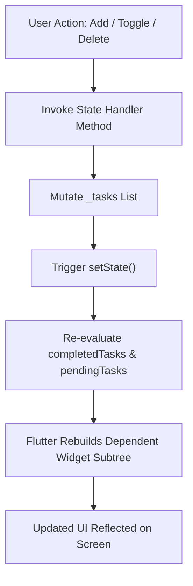

# 📝 My Tasks — Modern Flutter Todo List App

[](https://flutter.dev)
[](https://dart.dev)
[](https://m3.material.io)
[](#-platform-support)
[](#)

A sleek, intuitive, and modern **Todo List application** crafted in **Flutter & Dart**. This project showcases reactive local state management utilizing Flutter's core `StatefulWidget` and `setState()` mechanisms alongside Material Design 3 guidelines.

---

## 📌 Table of Contents

- [Overview](#-overview)
- [Key Features](#-key-features)
- [UI & Layout Breakdown](#-ui--layout-breakdown)
- [State Management & Reactive Flow](#-state-management--reactive-flow)
- [Project Architecture](#-project-architecture)
- [Getting Started](#-getting-started)
- [Code Implementation Highlights](#-code-implementation-highlights)
- [Assignment Criteria & Checklist](#-assignment-criteria--checklist)
- [Author & Credits](#-author--credits)

---

## 📖 Overview

The **My Tasks** application is designed to provide users with a clean, distraction-free task management experience. Beyond basic CRUD operations, it features a live statistics dashboard, smooth micro-interactions, custom toggle buttons, and dynamic empty-state feedback.

### Core Objectives
* Demonstrate practical implementation of **`StatefulWidget`** and **`setState()`**.
* Handle dynamic lists with **`ListView.builder`**.
* Implement user input processing using **`TextEditingController`**.
* Maintain real-time task metrics (Total, Completed, Pending).
* Deliver a responsive, aesthetically pleasing **Material 3** user interface.

---

## ✨ Key Features

| Feature | Description |
| :--- | :--- |
| ➕ **Quick Task Creation** | Input tasks effortlessly with keyboard action (`TextInputAction.done`) and tap-to-add button. Empty tasks are prevented via input validation. |
| 📊 **Real-time Statistics Dashboard** | Live cards dynamically tracking **Total**, **Done**, and **Pending** tasks using dynamic Dart getters. |
| 🔘 **Animated Completion Toggle** | Smooth 200ms container animation transitioning between an unchecked box and a vibrant checkmark with strikethrough typography. |
| 🏷️ **Status Badges** | Dynamic labels indicating either <span style="color:green;">**Completed**</span> or <span style="color:grey;">**In progress**</span> status per item. |
| 🗑️ **One-Tap Task Removal** | Instant task deletion with index safety and immediate metric recalculation. |
| 🌟 **Engaging Empty State** | Helpful zero-state illustration and prompt when no tasks are currently registered. |
| 🎨 **Material 3 Design System** | Indigo accent palette (`#5B5FEF`), curved header container, elevated cards, and soft shadow effects. |

---

## 📱 UI & Layout Breakdown

```text
┌──────────────────────────────────────────────────────────┐
│  (✓)  My Tasks                                           │
│       "3 tasks remaining"                                │
│  ┌───────────────┐ ┌───────────────┐ ┌────────────────┐  │
│  │   Total: 5    │ │    Done: 2    │ │   Pending: 3   │  │
│  └───────────────┘ └───────────────┘ └────────────────┘  │
└──────────────────────────────────────────────────────────┘
┌──────────────────────────────────────────────┬───────────┐
│ 📝  What needs to be done?                   │    [+]    │
└──────────────────────────────────────────────┴───────────┘
 Your Tasks                                         5 tasks
┌──────────────────────────────────────────────────────────┐
│ [✓]  Complete Flutter Assignment                  [ 🗑 ]  │
│      Completed                                           │
├──────────────────────────────────────────────────────────┤
│ [ ]  Read Flutter Documentation                  [ 🗑 ]  │
│      In progress                                         │
└──────────────────────────────────────────────────────────┘
```

### Visual Components:
1. **Header Banner**: Deep indigo background with curved bottom borders (`30px` radius) housing the app avatar, title, dynamic counter subtitle, and metric cards.
2. **Input Card**: Rounded search-style container (`16px` radius) with prefix icon and elevated add button.
3. **Task Cards**: High-contrast white card tiles with rounded corners (`18px` radius) and ambient shadow (`blurRadius: 10`).
4. **Custom Checkbox**: Smooth `AnimatedContainer` with rounded edges and state-dependent border/fill styling.

---

## 🔄 State Management & Reactive Flow

The application follows Flutter's declarative UI model: **UI = f(state)**.



### State Variables & Getters

* **`List<Map<String, dynamic>> _tasks`**: Stores individual tasks with `title` (String) and `completed` (bool).
* **`TextEditingController _controller`**: Manages the input field lifecycle.
* **`int get completedTasks`**: Computed getter counting completed items (`task['completed'] == true`).
* **`int get pendingTasks`**: Computed getter calculating `_tasks.length - completedTasks`.

---

## 📂 Project Architecture

```text
todo_list/
├── android/               # Android native configurations & gradle files
├── ios/                   # iOS native configurations & runner
├── web/                   # Web platform support files
├── macos/                 # macOS desktop configuration
├── windows/               # Windows desktop configuration
├── linux/                 # Linux desktop configuration
├── lib/
│   └── main.dart          # Primary application entry point & UI implementation
├── test/
│   └── widget_test.dart   # Widget testing suite
├── pubspec.yaml           # Dependencies, assets & metadata
└── README.md              # Project documentation & guide
```

---

## 🚀 Getting Started

### Prerequisites
* [Flutter SDK](https://docs.flutter.dev/get-started/install) (`^3.13.0` or later)
* [Dart SDK](https://dart.dev/get-dart) (`^3.0.0` or later)
* Android Studio / Xcode / VS Code with Flutter Extension
* An active Android emulator, iOS simulator, or connected physical device

### Installation & Run

1. **Clone the repository:**
   ```bash
   git clone https://github.com/Vrutti88/EMBatchAssignments.git
   cd EMBatchAssignments/todo_list
   ```

2. **Fetch dependencies:**
   ```bash
   flutter pub get
   ```

3. **Verify Flutter environment:**
   ```bash
   flutter doctor
   ```

4. **Launch the application:**
   ```bash
   flutter run
   ```

5. **Build release packages (optional):**
   ```bash
   # For Android APK
   flutter build apk --release

   # For Web
   flutter build web --release
   ```

---

## 💡 Code Implementation Highlights

### 1. Adding a Task with Input Validation
```dart
void _addTask() {
  final task = _controller.text.trim();

  if (task.isEmpty) return; // Prevent empty tasks

  setState(() {
    _tasks.add({
      'title': task,
      'completed': false,
    });
  });

  _controller.clear();
  FocusScope.of(context).unfocus(); // Dismiss keyboard
}
```

### 2. Toggling Completion State
```dart
void _toggleTask(int index) {
  setState(() {
    _tasks[index]['completed'] = !_tasks[index]['completed'];
  });
}
```

### 3. Deleting a Task by Index
```dart
void _deleteTask(int index) {
  setState(() {
    _tasks.removeAt(index);
  });
}
```

### 4. Dynamic Task Statistics
```dart
int get completedTasks {
  return _tasks.where((task) => task['completed'] == true).length;
}

int get pendingTasks {
  return _tasks.length - completedTasks;
}
```

---

## 📝 Assignment Criteria & Checklist

This project fulfills all requirements for the **Flutter Development Todo List Assignment**:

- [x] **StatefulWidget Architecture**: Built with `StatefulWidget` and `State<TodoHomePage>`.
- [x] **Reactive State Updates**: UI reacts immediately through `setState()`.
- [x] **Task Creation**: Fully functional text input with keyboard dismissal.
- [x] **Task Completion**: Toggle completion with visual strikethrough and label update.
- [x] **Task Deletion**: Safe index-based item removal.
- [x] **Dynamic Counters**: Real-time Total, Completed, and Pending indicators.
- [x] **Empty State Handling**: Elegant fallback view when no tasks exist.
- [x] **Clean Code Standards**: Properly formatted, lint-compliant code adhering to Flutter best practices.

---

## 👨‍💻 Author & Credits

* **Author:** Vrutti Patil
* **Technology:** Flutter & Dart
* **Design Guidelines:** Material Design 3

---

<p align="center">Made with ❤️ using Flutter</p>
